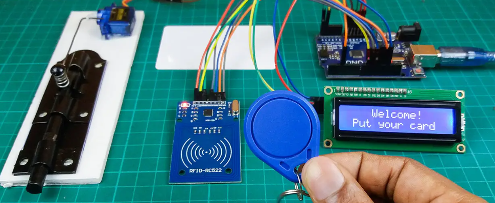

<h1 align="center">🔐 RFID-Based Smart Door Lock System</h1>

<p align="center">
  A secure, contactless, and intelligent door lock system powered by <strong>RFID technology</strong> and <strong>Arduino</strong>. 
  This project is perfect for smart homes, offices, and access-controlled zones. 🚪📶
</p>

---

## ✨ Features

- 🆔 RFID-based user authentication
- 🔒 Automatic door lock/unlock mechanism
- 📟 LCD status display (e.g. Access Granted / Denied)
- 🔔 Buzzer for sound alerts
- ⚡️ Low-power and efficient system
- 🧠 Easily programmable with Arduino
- 💬 Serial monitor support for debugging

---

## 🧰 Components Required

| 🛠️ Mechanical Components         | 🔌 Electronic Components                |
|-------------------------------|----------------------------------------|
| 🔩 Lock Mechanism (Solenoid)  | 🧠 Arduino UNO                          |
| 🪛 Screws & Mounting Plate    | 📡 RFID Module (RC522)                 |
| 🚪 Door Model / Wooden Frame  | 🆔 RFID Tags / Cards                   |
|                              | 📟 16x2 LCD Display (I2C or regular)   |
|                              | 🔔 Buzzer                               |
|                              | 📦 Breadboard & Jumper Wires           |
|                              | 🔋 9V Battery + Battery Connector       |
|                              | 📎 Resistors (for LED/buzzer)          |
|                              | 🔌 Power Supply Adapter (optional)     |

---

## 🔄 Working Principle

1. 📡 The RFID reader continuously scans for tags.
2. 🆔 When a valid tag/card is scanned:
   - ✅ **Access Granted** is shown on LCD.
   - 🔓 Door unlocks for a few seconds.
   - 🔔 Optional buzzer gives a short beep.
3. 🚫 If an invalid card is scanned:
   - ❌ **Access Denied** is displayed.
   - 🔕 No unlock, long beep for alert.

---

## 📸 Preview

<p align="center">
  
</p>

---
## 🛠️ Setup Instructions

 🔌 Connect all components as per the circuit diagram.

 📥 Upload the Arduino sketch (rfid_door_lock.ino) via Arduino IDE.

 🆔 Register RFID tags in code.

 ✅ Power up and scan a tag!

## 🧪 Future Enhancements

 📱 Add IoT-based mobile control (e.g., Blynk or MQTT)

 ☁️ Log entries to Google Sheets or Firebase

 📷 Add camera to capture access logs

 🔐 Multiple access levels (Admin/User)


💬 License
This project is open-source under the MIT License.
Feel free to fork and modify it for your smart automation ideas! 💡


## 🧠 Code Logic (Flowchart)

```mermaid
graph TD;
    Start --> ScanRFID
    ScanRFID --> ValidTag{Is Tag Valid?}
    ValidTag -- Yes --> UnlockDoor --> DisplayGranted --> Wait --> LockDoor
    ValidTag -- No --> DisplayDenied --> BuzzerAlert
    LockDoor --> End
    DisplayDenied --> End

